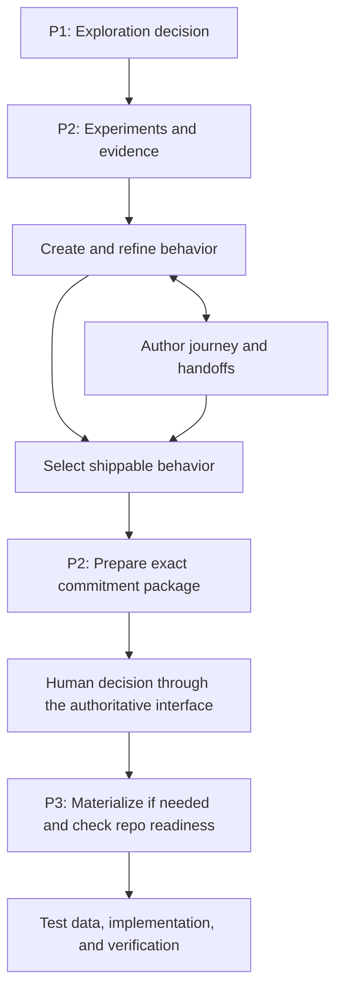

# One AIPOS plugin: consolidation, skill routing, and workflow

**Date:** 2026-09-19

**Status (2026-09-20):** Consolidation PR #31 and label-clarification PR #32 are merged. PE1–PE5 changes are in [draft PR #33](https://github.com/Accelerated-Innovation/govkit-plugins/pull/33); implementation and release review are recorded below and in the [follow-up report](../evaluations/2026-09-20-plugin-evaluation-followups.md). This does not reopen the completed cross-repository E1–E5 pilot. No new tag or publication is authorized by this status line.

**Direction:** One `aipos` plugin, eleven focused `aipos-*` skills, explicit AIPOS pillar workflows.

**Baseline inspected:** `9ec174d9a9d740fddb928f7367cf6e635d637499`; local `main` matched GitHub `main` during the planning review. Recheck before implementation.

## Outcome

A user installs AIPOS once and can move from exploration through validation into governed delivery. Each skill owns a distinct action, and the descriptions make the appropriate entry point discoverable from ordinary requests. Pillars explain the operating model; they do not require separate installations.

The current three-plugin structure is technically coherent but confusing to users: several skills in `govkit`, advertised as Pillar 3, now define the behavior that a Pillar 2 commitment approves. This plan retains the capabilities and consolidates their packaging.

This plan authorizes no publishing, installation changes on a user's machine, tracker writes, or implementation by itself. Those are separate execution steps. Creating this document changes only the plan.

## Decisions and scope

- Keep the marketplace name `aipos` and repository `Accelerated-Innovation/govkit-plugins`.
- Ship one plugin named `aipos`, under `plugins/aipos/`. Its installation identifier is `aipos@aipos` (plugin name followed by marketplace name).
- Rename all eleven public skills to the `aipos-` namespace, including the current `pdg-` and `val-` skills. Preserve their descriptive suffixes; the complete mapping below is the implementation checklist.
- This is an initial rollout. Remove the old `aipos-p1`, `aipos-p2`, and `govkit` plugin packages and catalog entries. Users with an early installation uninstall those plugins and install `aipos@aipos`. No compatibility aliases, deprecation period, automatic configuration migration, or upgrade/rollback matrix is required.
- Keep skills directly under `skills/<skill-name>/`; use documentation to group them by pillar. Do not introduce nested pillar folders or a mandatory routing skill.
- Preserve shared references as one canonical copy, inside the consolidated plugin. Keep mode-specific resources with their owning skill.
- Preserve `.govkit/` artifact paths, feature package layouts, script arguments, behavior identifiers, token fields, event schemas, and scoring arithmetic unless a separately scoped change is explicitly justified. Skill directory paths and skill IDs change as mapped below. GovKit remains the name of the execution contracts and integrations where applicable; do not globally replace every occurrence of `govkit`.
- Preserve the opportunity-first route, optional epic/tracker route, and projects without a decision service. Do not introduce an epic, estimate, tracker, or decision-service prerequisite.
- Retain the existing Claude plugin format (`.claude-plugin`). A Codex packaging port, new integrations, and support for additional AIPOS pillars are outside this plan.
- Fix demonstrated routing and workflow contradictions. Do not merge skills merely because they consume the same artifacts or share a rubric.

Target structure:

```text
.claude-plugin/marketplace.json          # one entry: aipos
plugins/aipos/
  .claude-plugin/plugin.json
  README.md
  references/                           # canonical Gherkin, identity, workflow guidance
  skills/
    aipos-quarterly-planning/
    aipos-rapid-validation/
    aipos-epic-create/
    aipos-feature-create/
    aipos-feature-refine/
    aipos-workflow-map/
    aipos-feature-slice/
    aipos-feature-map/
    aipos-feature-readiness/
    aipos-synthetic-data/
    aipos-metrics-emit/
```

The target has exactly eleven skill directories. No alias or duplicate skill directory is to be created.

### Skill rename map

| Current skill | Target skill |
|---|---|
| `pdg-quarterly-planning` | `aipos-quarterly-planning` |
| `val-rapid-validation` | `aipos-rapid-validation` |
| `govkit-epic-create` | `aipos-epic-create` |
| `govkit-feature-create` | `aipos-feature-create` |
| `govkit-feature-refine` | `aipos-feature-refine` |
| `govkit-workflow-map` | `aipos-workflow-map` |
| `govkit-feature-slice` | `aipos-feature-slice` |
| `govkit-feature-map` | `aipos-feature-map` |
| `govkit-feature-readiness` | `aipos-feature-readiness` |
| `govkit-synthetic-data` | `aipos-synthetic-data` |
| `govkit-metrics-emit` | `aipos-metrics-emit` |

The ownership and description tables use target names. Baseline evidence and early implementation steps use current names until increment 08 performs the rename. Historical completed plans and recorded evaluation traces retain the names that existed when they were written.

## Current evidence and defects to address

The baseline has `aipos-p1` 0.1.1 (one skill), `aipos-p2` 0.4.0 (one skill), and `govkit` 0.17.0 (nine skills). Catalog descriptions and keywords agree with their manifests; skill names are unique. Preserve those consistency properties.

| Finding | Current source | Required correction |
|---|---|---|
| Refine claims any mention of Gherkin, acceptance criteria, or Development Token | `plugins/govkit/skills/govkit-feature-refine/SKILL.md` description | Distinguish authoring, existing-spec review, and execution-readiness requests by requested action and context. |
| Readiness has a short, unfinished-sounding description with weak invocation signals | `govkit-feature-readiness/SKILL.md` description | Explicitly own repo readiness and token requests; describe the prerequisites and output. |
| Validation and epic creation both claim problem sizing, framing, and success criteria | Both skill descriptions; epic lifecycle section | Separate evidence gathering and experiments from creating an explicitly requested planning artifact. |
| Workflow-map claims to generate views, while its body delegates rendering | `govkit-workflow-map/SKILL.md` description and Scope | Workflow-map owns source authoring; feature-map owns rendering. A request for both has a two-step handoff. |
| Feature-map selects a rubric using tracker versus repo storage | `govkit-feature-map/SKILL.md` and `references/scoring.md` | Choose by lifecycle stage and requested assessment. A repo-resident Draft 0 still needs refinement. |
| Completeness metrics can be read as execution authorization | `govkit-metrics-emit/SKILL.md`, `references/event_schema.md` | Distinguish the existing completeness metric from the Development Token and product approval. Preserve event calculations and contracts. |
| Narrative still emphasizes an epic-first, post-validation specification route | Root README, plugin READMEs, epic lifecycle section | Document progressive behavior definition during P2 and the optional epic route. GovKit README currently lists eight skills rather than nine. |
| Tests contain physical `plugins/govkit` assumptions | `tests/conftest.py`, `test_repo_ingest.py`, `test_script_installability.py`, `test_plugin_boundaries.py`, `test_token_record_contract.py` | Update discovery and paths without weakening coverage or allowing an empty scan to pass. |
| Existing evaluations preload the chosen skill | `evals/run_evals.py:build_subject_request` | Add a distinct routing evaluation that sees the full description catalog before selecting a skill. |

There are forty model-graded cases across seven skills at this baseline. Quarterly planning, feature-map, readiness, and synthetic-data have no `evals/evals.json`. The existing metrics cases require a runtime repository and are skipped by the text-only harness. Case counts are inventory, not passing results. No model evaluations were run for this planning review.

## Ownership and workflow

### One owner for each action

| Skill | Lifecycle use | Owns | Boundary / handoff |
|---|---|---|---|
| `aipos-quarterly-planning` | P1 | Live graph evidence review and a draft exploration-decision log | Requires live graph reads; does not record authoritative decisions or plan delivery releases. |
| `aipos-rapid-validation` | P2 | Experiments, evidence synthesis, viability brief, prepared commitment package | Delegates canonical behavior authoring; cannot grant product approval. |
| `aipos-epic-create` | Optional P2/P3 planning support | An explicitly requested epic, initiative, or program brief | Does not decide whether the opportunity is viable or become a mandatory entry point. |
| `aipos-feature-create` | P2 authoring; P3 materialization | New behavior specifications, epic decomposition, or faithful materialization of an approved baseline | Does not review its own draft, grant a token, or implement application code. |
| `aipos-feature-refine` | P2 review; later change review | Existing-spec quality, 3 Amigos, evidence gaps, proposed changes to committed behavior | Refine recommends readiness; it does not issue the execution token or approve a scope change. |
| `aipos-workflow-map` | P2 journey definition; later maintenance | Workflow source, actors, transitions, handoffs, behavior references, coverage findings | Creates no second copy of canonical behavior; hands rendering to feature-map. |
| `aipos-feature-slice` | P2 scope selection; later release changes | Proposed release selection and shippability; optional complexity diagnostics | Does not approve commitments or forecast delivery time from points. |
| `aipos-feature-map` | Throughout P2/P3 | Corpus visualization and orchestration of advisory assessments | Calls the owning rubric; does not issue tokens, author journey source, or decide release scope. |
| `aipos-feature-readiness` | P3 | Repo execution-readiness report and Development Token record | References applicable product approval; readiness is distinct from implemented or verified behavior. |
| `aipos-synthetic-data` | Delivery support | Repeatable generators and scenario- or schema-derived datasets | Does not invent constraints, mask production data, or implement the feature. |
| `aipos-metrics-emit` | Delivery observation | Existing structured metric events and completeness diagnostics | Does not issue readiness decisions or aggregate organization-level metrics. |

### Default AIPOS route



This is a lifecycle guide, not a mandatory invocation chain:

- Validation may begin without a P1 mandate. A no-go ends the proposed investment; revise returns to the relevant experiment or scope work.
- Behavior and journey definition iterate as evidence develops. Early experiments do not require production specifications.
- The commitment package references the selected Rules/scenarios at an immutable source revision. Preparing it is not approval.
- Existing approved packages can enter at readiness; existing drafts can enter at refine. Materialization is only needed when the approved package is not already present.
- Epic authoring and decomposition remain optional for teams using those artifacts.
- Feature-map can render existing source without reauthoring it. Metrics can observe any stage with relevant artifacts; completeness must be explained in that stage's context.
- Product approval, local execution readiness, current authority, and implementation evidence remain separate. With no decision service, local readiness retains its existing behavior and claims no external approval.
- Application implementation and the authoritative product decision are outside these eleven skills.

## Description contract

Describe the requested action, usable input context, concrete result, and the most likely competing boundary. Put essential routing cues in frontmatter; detailed procedures belong in the body. Avoid broad noun-only triggers such as "whenever Gherkin is mentioned."

Use a single canonical description per skill. The routing evaluator must read actual frontmatter rather than a second manually maintained description list. Human-facing catalogs summarize the same ownership.

Proposed plugin description:

> AIPOS skills for evidence-based discovery, rapid validation, and governed AI-assisted delivery. Plan exploration, test assumptions, define and refine behavior, select release scope, prepare commitment packages, check repository readiness, visualize work, generate synthetic data, and emit delivery metrics. Skills support the pillars and their handoffs in one installation; product approval remains with the accountable authority.

The following are initial candidate descriptions. Tune them against routing evidence during the increments; they are not immutable wording requirements.

| Skill | Candidate description |
|---|---|
| `aipos-quarterly-planning` | Prepare quarterly exploration planning from a live Product Definition Graph. Use for evidence-backed opportunity review, research gaps, and exploration decisions with owners, budgets, and horizons. Requires graph reads and drafts the decision log; delivery release planning belongs elsewhere. |
| `aipos-rapid-validation` | Design experiments and synthesize evidence to decide whether an opportunity merits investment. Use for interviews, problem sizing, prototypes, demand tests, feasibility, experimental AI evaluations, viability briefs, and commitment-package preparation. Delegate production behavior authoring to feature-create. |
| `aipos-epic-create` | Create or improve an epic, initiative, or program brief covering the problem, outcomes, evidence, scope, risks, and shared constraints. Use when that planning artifact is requested. Opportunity validation and feature-level acceptance criteria have separate owners. |
| `aipos-feature-create` | Author new Rules, Gherkin scenarios, and feature packages from opportunities or feature briefs; decompose an epic; or materialize an approved baseline unchanged. Use for creating specifications. Existing-spec review belongs to refine; application implementation is outside this skill. |
| `aipos-feature-refine` | Review and improve an existing feature specification with Product, QA, and Engineering. Use for 3 Amigos, ambiguity, missing behavior, evidence gaps, and draft rewrites. For committed behavior, propose changes for reapproval. Repo execution-readiness and token decisions belong to readiness. |
| `aipos-feature-slice` | Select a complete release from existing scenarios, check prerequisites, and recommend MVP/V1/V2 scope. Use for the smallest shippable outcome, release tags, and scenario splitting. Optionally assess scenario complexity; those scores do not forecast delivery time. |
| `aipos-workflow-map` | Author or update workflow.json describing a customer journey, actors, branches, and handoffs, with references to canonical behavior. Use for journey structure and coverage gaps. Delegate rendering of existing workflow source to feature-map. |
| `aipos-feature-map` | Render an existing feature corpus and optional workflow source into an HTML view of dependencies, specifications, and advisory readiness or complexity assessments. Use for release dashboards and cross-feature comparisons. Delegate assessments to their owning skills; this view does not authorize execution. |
| `aipos-feature-readiness` | Check whether a reviewed repository feature package is ready for AI-assisted implementation and produce its Development Token record. Use for pre-coding checks, repo fit, verification paths, and token requests. Verify applicable existing product approval; this skill does not grant that approval. |
| `aipos-synthetic-data` | Generate repeatable synthetic datasets and seeded Faker generators from feature scenarios or an explicit schema. Use for fixtures, boundary cases, sample records, and load data. State whether coverage is scenario-derived or schema-derived; production-data masking is outside scope. |
| `aipos-metrics-emit` | Compute and export structured delivery and quality events from GovKit repository artifacts, CI exports, PR exports, and git history. Use for NDJSON telemetry and completeness reporting. Execution-readiness decisions belong to readiness; organization-level aggregation belongs downstream. |

## Sliced implementation increments

Use one reviewable PR per increment. Each should leave the current checkout structurally valid. The consolidation release is held until the release checkpoint; merging a preparation increment does not imply that the new plugin has shipped. If merging to `main` makes changes immediately available through marketplace refresh, use a dedicated integration branch for the candidate and merge the completed release together.

All statuses start unchecked. Record the implementing PR/commit and verification evidence when completing an increment.

| ID | Slice | Depends on | Status |
|---|---|---|---|
| 01 | Ownership examples and routing cases | This plan | [x] |
| 02 | Routing evaluator and baseline | 01 | [x] |
| 03 | Discovery, validation, and epic boundaries | 02 | [~] |
| 04 | Create, refine, and readiness boundaries | 03 | [~] |
| 05 | Journey authoring, slicing, and visualization boundaries | 04 | [~] |
| 06 | Metrics and synthetic-data boundaries | 05 | [~] |
| 07 | Packaging tests independent of old directory names | 06 | [x] |
| 08 | Rename all eleven skills to `aipos-*` | 07 | [x] |
| 09 | Atomic consolidation into `plugins/aipos` | 08 | [x] |
| 10 | Pillar workflow and onboarding documentation | 09 | [x] |
| 11 | Clean-install and old-plugin removal check | 10 | [x] |
| 12 | Combined routing and workflow acceptance | 11 | [~] |
| 13 | Release checkpoint and rollout handoff | 12 | [~] |

### 01 — Turn the ownership model into observable examples

**Change:** Add a small routing case corpus under `evals/routing/`. Define each case's prompt, relevant context, expected primary skill or no-skill/clarification outcome, permitted handoffs, and forbidden competing routes. Include the full eleven-skill inventory without duplicating their descriptions. Link the ownership model from contributor guidance.

Start with at least two positive cases per skill, paired cases for every collision in this plan, and unrelated requests that should select no AIPOS skill. Include multi-step requests where one primary owner hands off to another; selecting every vaguely related skill is not success. Reserve a small held-out set of paraphrases for increment 12. Use current skill IDs until increment 08 updates the expectations to their target names.

**Check:** Fixtures resolve; case identifiers are unique; expected skill names exist. Review expectations against bodies and actual capabilities, not just desired wording.

**Done:** Every skill has a demonstrated owning intent, and each known collision has a contrasting pair of prompts. No skill behavior changes in this slice.

### 02 — Evaluate selection before loading a skill

**Change:** Add a bounded runner, for example `evals/run_routing.py`, that discovers installed-candidate skill names and frontmatter descriptions, presents all eleven together with one case, and records the selected primary skill, handoffs, or clarification/no-skill result. Do not preload skill bodies or tell the subject the expected answer. Keep this separate from `run_evals.py`'s coaching evaluations.

Reuse existing evaluation infrastructure where useful. Dry run is the default; live calls require `--execute`. Fingerprint the full catalog, cases, subject model/configuration, and repetitions. Preserve raw traces, invalid responses, skips, and errors. Compare allowed outcomes deterministically where possible; a second model is only needed for genuinely qualitative judgments and must be identified.

**Check:** Meaningful runner tests cover missing skills, duplicate names, changed descriptions invalidating results, no-skill answers, and ordered handoffs. Run a baseline against the unchanged descriptions using an explicitly chosen model and run budget; use three repetitions for comparisons. If unavailable, record the blocker rather than invent a baseline.

**Done:** We can measure catalog selection separately from execution quality. Label this a routing proxy, not proof of the host client's native skill selection; the installed-client check comes later.

### 03 — Clarify discovery, validation, and epic ownership

**Change:** Update the descriptions and necessary scope/handoff passages for `pdg-quarterly-planning`, `val-rapid-validation`, and `govkit-epic-create` in their current locations. Keep P1's live-MCP requirement and read-only decision log. Distinguish experiments and problem sizing from an explicitly requested epic. Remove the implication that every opportunity must become an epic after a go decision.

**Check:** Route research allocation to P1, experiment design and opportunity sizing to validation, and explicit epic drafting to epic-create. Preserve the existing validation/epic behavioral cases. Add a representative P1 behavior case with supplied tool observations in a suitable harness; do not simulate a live connection as a successful real read.

**Done:** Generic success-metric or problem-framing requests use their context; neither epic-create nor validation captures the other's explicit deliverable. Missing context leads to one useful clarification when it changes the action.

### 04 — Separate authoring, review, and execution readiness

**Change:** Update feature-create, feature-refine, and feature-readiness descriptions and relevant handoffs. Remove noun-only refinement triggers and feature-create's implication that it implements application code. Preserve baseline materialization, committed-behavior change proposals, and both existing rubric scales.

**Check:** Contrast new acceptance criteria, review of existing criteria, and a token request for a reviewed repo package. Cover an approved baseline whose behavior must remain unchanged. Add readiness coaching coverage for missing prerequisites and the distinction between prepared, locally executable, authority verified, and implementation verified; retain deterministic state/token tests.

**Done:** One owner is selected for each action. A refinement recommendation or prepared package never reads as permission to implement committed scope.

### 05 — Separate journey source, release selection, and views

**Change:** Update workflow-map, feature-slice, and feature-map descriptions and handoffs. Make rendering ownership explicit. In feature-map and its scoring reference, select the rubric by review state and requested assessment rather than by storage location alone. Keep sizing optional; remove cost/forecast implications from the map's discovery language.

**Check:** Contrast authoring a journey, rendering an existing `workflow.json`, selecting an MVP, and visualizing release readiness. A repo-resident Draft 0 receives refinement assessment; a reviewed repo package can receive readiness assessment. Unknown or mixed lifecycle state is surfaced rather than silently inferred from a directory. Add feature-map behavior cases for those distinctions.

**Done:** Journey order, selected release scope, dependency flow, and readiness are distinct. Rendered badges remain advisory and identify the rubric. Shared scoring logic stays with its current owner.

### 06 — Separate metrics reporting and data generation from gates

**Change:** Update metrics-emit and synthetic-data descriptions and scope. Clarify that the existing 0–100 completeness measure does not itself authorize execution; retain its event vocabulary and calculations. Explain why a newly ready package may lack later platform artifacts such as `plan.md`. Preserve synthetic-data's explicit schema-only path.

**Check:** Route event exports and completeness breakdowns to metrics; route token decisions to readiness and visual corpus comparisons to feature-map. Test scenario-derived data, schema-only data, and a production-masking request. Preserve the reserved status of `refinement.token.issued`; do not claim the emitter reads token records or emits events it does not currently implement.

**Done:** Documentation separates metric readiness terminology from execution authority. Existing metric cases are updated where their expectations perpetuate the confusion; tool-dependent cases are exercised in a suitable harness or recorded as unrun, never counted as passes.

### 07 — Make packaging checks survive the move

**Change:** Remove scattered hard-coded old plugin paths from test support and script invocations. Prefer a small shared test locator that resolves each skill unambiguously; do not build a production plugin registry. Keep the current three-plugin layout working through the skill rename in increment 08; package consolidation follows in increment 09.

Strengthen structural coverage to reject duplicate skill names, unresolved resources, and paths escaping the owning plugin. Keep canonical shared-reference and declared-dependency checks. A one-plugin layout must not turn boundary checks into a vacuous pass. Correct stale test explanations suggesting that skills within a plugin necessarily install independently.

**Check:** Run the full deterministic suite. Demonstrate that a missing or duplicated skill produces a clear failure and that a copied plugin can resolve required resources without access to neighboring source directories.

**Done:** The later package move needs a narrowly scoped root/catalog update; tests still cover the actual shipped scripts and existing fixtures.

### 08 — Rename all eleven public skills

**Change:** Apply the rename map mechanically within the current plugin directories. Update each skill folder and frontmatter `name`, cross-skill handoffs and paths, active README/catalog examples, script-location references, test locators and assertions, evaluation `skill_name` fields, routing expectations, templates, and CI examples. Preserve case IDs and fixture contents unless they explicitly reference a renamed skill. Keep this slice separate from description tuning and the package move.

Keep execution contracts unchanged: `.govkit/`, feature package files, Rule/scenario IDs, token fields, metric schemas, script arguments, and calculation behavior retain their existing meanings. Historical completed plans and old result traces keep their original names; this plan's rename map explains the transition.

**Check:** All eleven folders agree with frontmatter and evaluation skill IDs; no old name remains as an active skill or unresolved handoff. All local references resolve, deterministic tests pass, and evaluation request assembly works with the new IDs. Re-run routing under the new names because names influence selection. Preserve old results as baseline evidence, use the rename map for comparisons, and never reuse cached grades as results for the renamed catalog.

**Done:** The current three-package candidate contains exactly eleven `aipos-*` skills with no aliases or duplicate old skill folders. Only names and their references change in this slice; the consolidated release remains unpublished until the later checkpoint.

### 09 — Consolidate the package atomically

**Change:** Move the existing GovKit plugin to `plugins/aipos`, move P1's and P2's complete skill directories into its `skills/`, and retain GovKit's shared references there. Move rather than copy the skill implementations. Update the manifest name/description, marketplace source and single entry, directly affected active paths, and minimum install instructions together. Preserve useful old README content for the documentation slice rather than silently dropping it.

Use `1.0.0` as the proposed initial unified-plugin version, documenting the three predecessor versions. Early users remove the previous plugins and make a fresh installation of the new plugin.

Remove the three old distributable plugin entries and directories in the same change. Create no alias plugins, symlink shims, empty compatibility plugins, or deprecation releases. Retain historical evidence through Git; active installation guidance needs only the remove-old/install-new steps.

**Check:** `claude plugin validate .`; all deterministic tests; exactly one catalog plugin and eleven unique `aipos-*` skills; all forty baseline cases and their bundled fixtures retained under renamed skill IDs, plus newly added cases. Diff review confirms skill bodies/scripts changed only as required for paths or branding in this slice. Reassemble evaluation requests to verify resources still resolve.

**Done:** One coherent candidate package works from its new root. There is no intermediate published state with missing skills or duplicate implementations. This mechanical move is deliberately one slice because splitting it across published states would break discovery or dependencies.

### 10 — Publish one coherent workflow in the documentation

**Change:** Rewrite root/plugin READMEs and contributor/template guidance around one install, pillar entry points, and the ownership table. Explain pre-commitment specification work, optional epic use, change/reapproval loops, and projects without a decision service. Describe when external MCP connections are needed; consolidation does not supply a PDG server or tracker access.

Keep active instructions and links current. Historical completed plans remain historical; label or cross-link them where needed rather than rewriting their recorded decisions. Replace outdated skill counts and remove stale claims that every skill already has behavior evaluations.

**Check:** Walk the instructions as a new user and as a user with a validated opportunity or an existing reviewed package. Verify local links, examples, prerequisites, and the distinction between marketplace and plugin names.

**Done:** A user can find the next skill from their current artifact and decision, without guessing a pillar or installing another AIPOS package.

### 11 — Verify fresh installation and old-plugin removal

**Change:** Document and verify the simple rollout: uninstall any early `aipos-p1@aipos`, `aipos-p2@aipos`, and `govkit@aipos` installations, refresh the marketplace as needed, and install `aipos@aipos`. Verify the target client's actual commands before publishing the instructions. Catalog deletion alone must not be described as removing a user's installed copy.

Use an isolated client/project to test a fresh installation and one representative remove-old/install-new path. Remove early plugins from their installed scopes so they cannot remain active alongside the new one. A compatibility test matrix, automatic conversion of saved prompts/configuration, and a rollback guide are outside this initial rollout. Do not manipulate a real user's configuration as part of this check.

**Check:** The client discovers exactly eleven `aipos-*` skills; no old plugin or old skill set remains active. Invoke representative bundled scripts from an unrelated project directory with only the new plugin installed and declared dependencies available. Verify shared references, updated invocation examples, and skill handoffs resolve.

**Done:** Fresh installation and removal of the early plugins work on the recorded client version. The short installation instructions use only the new names after the removal step.

### 12 — Verify the combined catalog and complete handoffs

**Change:** Run the complete routing corpus, held-out paraphrases, and affected coaching evaluations against the unified candidate. Exercise representative workflows with all skills available: opportunity to prepared commitment, reviewed package to readiness, existing workflow to rendered view, and committed behavior to a proposed change package. Use an isolated project and fixtures; external approvals and tracker writes are not needed to test these handoffs.

**Check:** Compare with increment 02 using the same model/configuration and at least three repetitions, matching old and new skill identities through the rename map. Proposed release targets: at least 90% allowed routing outcomes overall, and every critical boundary case correct in every repetition. Critical cases cover create versus review, readiness versus metrics/badges, prepared versus approved, and preservation of committed behavior. Report numerators, denominators, traces, and failures; do not conceal regressions in an aggregate score.

Also run representative native-client selection smoke checks with the installed plugin, including interactions with other enabled skills when feasible. The synthetic routing runner alone cannot establish native host behavior. Record the external skill catalog used so any limitation is visible.

**Done:** No unresolved critical misroute or broken handoff remains. Nondeterministic checks stay manual; offline CI remains deterministic. Skipped tool-dependent evaluations are listed with the missing evidence and block any acceptance claim that depends on them.

### 13 — Release checkpoint and rollout handoff

**Change:** Assemble release notes, the verified remove-old/install-new instructions, and a compact validation record. State that public skills now use `aipos-*` and that `.govkit/` execution contracts remain unchanged. List the actual candidate commit/version, client version, models, cases, repetitions, results, and remaining limitations.

**Check:** One plugin/eleven `aipos-*` skills; old plugin entries and skill directories removed; manifests and catalog agree; deterministic suite passes; packaging and clean-install checks pass; routing and critical workflow evidence meet increment 12. Recheck upstream changes before final integration. Do not claim historical case results remain current after a skill name, description, fixture, or reference changes.

**Done:** The candidate is reviewable and ready for the normal release action. Publishing/merging and changes to a user's installed plugins occur only within the authorization for that implementation session. Record the actual release commit and rollout outcome after they occur.

## Required routing contrasts

These examples seed increment 01. Expand with realistic paraphrases and context; do not grade exact phrase matching.

| Request / context | Expected owner or sequence |
|---|---|
| Which evidenced problems deserve research capacity next quarter? | Quarterly planning, with live graph prerequisite |
| Do people want this? Plan a demand test. | Rapid validation |
| Write an epic from this validated opportunity. | Epic-create |
| Draft acceptance criteria from these interview findings. | Feature-create |
| Review these existing acceptance criteria for ambiguity. | Feature-refine |
| Issue a token for this reviewed repo package. | Feature-readiness |
| Implement the approved feature in application code. | Application implementation outside these skills; do not substitute spec authoring |
| Materialize the package selected by this approved baseline. | Feature-create, baseline mode |
| Map the actors and handoffs in this customer journey. | Workflow-map |
| Render these existing features and workflow.json. | Feature-map |
| Define this journey and show me its diagram. | Workflow-map, then feature-map |
| Select the smallest usable release from these scenarios. | Feature-slice |
| Show dependencies and advisory readiness across this release. | Feature-map, calling the appropriate assessment owner |
| Score this repo-resident, unreviewed Draft 0 corpus. | Feature-map with refine assessment; repository location does not imply review |
| Export repository metric events as NDJSON. | Metrics-emit |
| Is this feature ready? | Use known lifecycle/context; clarify if the requested decision is ambiguous |
| Generate fixtures for these scenarios. | Synthetic-data |
| Generate sample records from this explicit schema. | Synthetic-data, schema-derived coverage |
| Mask these production customer records. | Outside synthetic-data scope |
| Clean up this approved Rule and add an omitted recovery path. | Refine's change proposal path; no direct approved-behavior edit |
| Calculate delivery dates from scenario complexity totals. | No supported forecast; explain the metric's limits |
| Summarize a news article / fix unrelated CSS / schedule a meeting. | No AIPOS skill |

## Verification and implementation record

Use the repository's existing deterministic checks where appropriate:

```bash
claude plugin validate .
python -m pytest tests -q
python evals/run_evals.py --list
python evals/run_evals.py --skill aipos-feature-create
```

The last command uses the target skill ID after increment 08; use `govkit-feature-create` before that rename. It is request assembly only, not a model evaluation. Run affected live cases deliberately with `--execute`, declared models/configuration, and a bounded run size; include skips and actual results. The routing runner's exact CLI is defined in increment 02 and must be documented before use.

Do not add wording-matching tests for skill headings or descriptions. Deterministic tests validate packaging, fixture integrity, parsers, calculations, and executable contracts; behavioral evaluations validate selection and coaching.

For each increment, append a short record here or link its PR containing: completed scope, changed surfaces, commands and actual results, model/client evidence when relevant, remaining limitations, and next increment. Only mark its status complete when its acceptance checks are satisfied.

## References

- [Current behavior-contract design](2026-09-17-aipos-behavior-contract.md): progressive behavior definition, canonical artifacts, selected scope, and authority distinctions. This plan changes local packaging and routing, not cross-repository product policy.
- [Earlier skill-flow review](2026-08-24-skill-flow-review-fixes.md): two rubric scales, token record, later platform artifacts, and shared guidance.
- [Contribution and verification guidance](../../CONTRIBUTING.md).
- [Existing behavioral evaluation harness](../../evals/README.md).

## Implementation evidence

Entries below are chronological. Earlier budget/PR statements describe the initial offline phase; the live-verification record at the end supersedes them.

Entries below are chronological. Earlier budget/PR statements describe the initial offline phase; the live-verification record at the end supersedes them.

### Increment 01

- Added 53 routing cases, including six held-out paraphrases, two or more positive
  development cases per skill, conflicting intents, ordered handoffs, clarification,
  and out-of-scope requests.
- Added case integrity checks and linked ownership guidance from CONTRIBUTING.
- Validation: `PYTEST_DISABLE_PLUGIN_AUTOLOAD=1 python3 -B -m pytest
  tests/test_routing_cases.py tests/test_eval_cases.py -q -p no:cacheprovider`:
  **29 passed, 1 skipped** (an existing skill has no fixture directory).
- Starting full-suite baseline: **373 passed, 1 skipped**. Pytest plugin autoload
  is disabled locally because an unrelated globally installed rerun plugin tries
  to open a socket disallowed by the sandbox.
- No model calls in this increment. Next: the routing runner and measured baseline.

### Increment 02 — runner complete; live baseline pending

- Added a description-only routing evaluator with explicit model/call caps,
  exact outcome grading, stale-result protection, snapshots, raw traces, and
  missing/critical-case accounting. Held-out cases are excluded by default.
- Captured the unchanged catalog and all cases at
  `.claude/routing/baseline/inputs.json` before changing descriptions. This local
  snapshot allows a later live baseline without reconstructing old inputs.
- `.venv/bin/python -B -m pytest tests/test_routing_cases.py
  tests/test_routing_runner.py -q -p no:cacheprovider`: **16 passed**.
- Dry-run request assembly: **11 skills, 47 development cases, 3 repetitions**;
  no model was called. Live evaluation budget is pending user input. Description
  work can proceed against the frozen baseline, but this increment is not marked
  complete until its live comparison evidence exists.

### Increments 03–06 — boundaries implemented; live evaluations pending

- Updated all eleven descriptions and the conflicting body passages: optional
  epics, progressive behavior definition, review state rather than storage location,
  journey source versus rendering, and completeness versus execution authority.
- Added eight behavior cases covering previously missing skills and the metrics
  boundary. The inventory is now 48 cases across eleven skills; these are fixtures,
  not reported model passes. The three runtime-dependent metrics cases remain
  outside the text-only evaluation harness.
- Preserved script behavior, scoring, `.govkit/` artifacts, and execution contracts.
- Local commits: `31f0e90`, `97865cd`, `43d21a3`, `b6419c6`.
- Request assembly and fixture checks passed. Live selection/coaching evidence
  remains pending a model evaluation budget, so these slices remain partial.

### Increment 07

- Tests locate skills by their unique installed directory names instead of assuming
  the original plugin layout. Missing and duplicate skills fail explicitly.
- Added real YAML frontmatter validation, resource containment/resolution checks,
  and a copied-plugin ingestion check launched from an unrelated project.
- `.venv/bin/python -B -m pytest tests -q -p no:cacheprovider`:
  **409 passed, 5 skipped**. Skips are fixture-directory checks for cases without
  file fixtures, not hidden model results.

### Increment 08

- Renamed all eleven skill directories and frontmatter names to `aipos-*`;
  updated active handoffs, script usage examples, tests, evaluation expectations,
  CI references, requirements, and the skill template. No aliases were added.
- Historical plans and the frozen pre-change routing snapshot retain original IDs.
- Full offline suite: **409 passed, 5 skipped**. Marketplace validation passed;
  behavior inventory resolves 48 cases across eleven renamed skills. Routing dry
  run resolves all eleven skills and 47 development cases.
- Only public skill names/paths changed. `.govkit/`, scoring and event contracts
  retain their prior identities. Live before/after routing comparison is pending.

### Increment 09

- Consolidated the complete skill directories and canonical references under
  `plugins/aipos/`; removed the three original packages/catalog entries. The
  marketplace now contains exactly one `aipos` entry matching its 1.0.0 manifest.
- Updated active source paths and strengthened the catalog check to require one
  package, one entry, and the correct local source. Kept the repository identity.
- Marketplace and plugin manifest validation both passed. Full offline suite:
  **405 passed, 5 skipped**. Four parameterized file checks disappeared because
  two old README files and two old manifests were removed; no test was disabled.
- Public onboarding prose is replaced in the next documentation slice.

### Increment 10

- Replaced the root and plugin READMEs with one installation path and the full
  eleven-skill inventory. Added `docs/workflow.md` and the short rollout guide;
  updated contributor and template guidance to use action-based descriptions.
- Documented progressive P2 specifications, optional epics/mandates/decision
  services, lifecycle-based assessment, external MCP prerequisites, and runtime
  dependency files. Removed old package names from active skill handoffs.
- Fixed remaining body/reference contradictions found during the documentation
  walkthrough: “validation runs first” handoffs, the experimental-eval reference's
  post-decision-only claim, and statements claiming the reserved token event is
  already emitted. No metric code or event schema fields changed.
- CI now validates the plugin manifest explicitly as well as the marketplace.
- Forty local links resolve across nine updated guides; `git diff --check`
  passed. Full offline suite: **405 passed, 5 skipped**.
- Slices use focused local commits on the integration branch; PR/release activity
  is deferred. Increment 08 remains partial because its live routing rerun is
  pending along with increments 02–06.

### Increment 11

- Verified with Claude Code **2.1.274**, using two isolated `CLAUDE_CONFIG_DIR`
  profiles and a separate project under `/private/tmp/aipos-install-eq2hgh0f`.
  Real user plugin settings and installations were not changed.
- Fresh installation: added the local candidate marketplace, installed
  `aipos@aipos`, and checked `plugin list --json` plus `plugin details`.
- Replacement: installed all three original versions from the baseline Git
  archive, uninstalled each at user scope, replaced the disposable marketplace
  source, ran `marketplace update aipos`, and installed `aipos@aipos`.
- Both profiles contain exactly one enabled plugin, version **1.0.0**, with
  eleven `aipos-*` skills and no other enabled plugin. Installed runtime files
  match the candidate byte for byte and all skill resource references resolve.
- From the unrelated project, seven CLI checks passed across six installed
  scripts: Gherkin ingestion, workflow rendering, local readiness, batch refusal
  to write a token, change proposal preparation, validated metric emission, and
  sizing arithmetic. The proposal remains unsubmitted with `decision: null`.
- A syntax-tree comparison of all nine bundled Python scripts against the
  baseline found no executable changes after normalizing the intended public
  skill namespace and removing docstrings.
- Logs and outputs are local evidence at `.claude/install-check-results.json`,
  `.claude/install-inventory.json`, and the temporary project. No model calls
  were made; native skill selection remains an increment 12 check.

### Increments 12–13 — offline evidence and handoff prepared; acceptance open

- Verified all forty original cases remain, with 48 total cases across eleven
  skills. Dry request assembly passed for every skill. Candidate routing assembly
  resolves 53 cases (47 development, six held-out), with three repetitions
  configured; no model was called and there is no measured routing pass rate.
- Saved a renamed candidate snapshot at `.claude/routing/candidate/inputs.json`.
  The unchanged baseline snapshot remains intact with its original names.
- Rechecked upstream: `origin/main` remains
  `9ec174d9a9d740fddb928f7367cf6e635d637499`; no integration conflict appeared.
- Prepared `docs/release-check.md` with exact candidate/client versions, offline
  and installation results, remaining live/native workflow checks, and limitations.
  Candidate `ac867c9` includes the tested plugin content and completed install
  record; the next commit changes verification documentation only.
- Live baseline/candidate comparisons, coaching evaluations, and native model
  selection are pending a spending limit. Consequently increments 02–06, 08,
  12, and 13 remain partial. Installation inventory and executable checks are
  complete but are not substitutes for those acceptance checks.
- No push, PR, merge, tag, publication, tracker write, or real-user plugin change
  was performed. `docs/rollout.md` is ready for the eventual release.


## Live verification and PR handoff

**Historical September 19 handoff:** The user authorized push, PR creation, and paid model evaluations without a spend cap. The following results describe source `a1e2522` from [PR #31](https://github.com/Accelerated-Innovation/govkit-plugins/pull/31), merged September 20 as `73d24ae`. [PR #32](https://github.com/Accelerated-Innovation/govkit-plugins/pull/32) subsequently clarified PE labels and merged as `c622ec4`. The historical outstanding items below are superseded by the PE follow-up record; historical measurements remain unchanged.

- Catalog comparison: **147/159 baseline**, **159/159 candidate** under the same Sonnet 5 evaluator, three repetitions, all 53 cases. All 102 critical candidate trials pass. The descriptions in the evaluated snapshot match the final source.
- Native selection: **6/6**, with eleven AIPOS skills and seventeen observed built-in competitors. Four isolated native workflow artifact checks also pass; no supplied source file was changed.
- Coaching: **87/135 passed**, **48 failed**, across all 45 runnable cases with three repetitions. Four subject-truncated trials count as failures, including two favorable judge verdicts; no new model calls were used for that deterministic correction. Three original metrics fixture cases remain unrun. The [full report](../evaluations/2026-09-19-aipos-live-evaluation.md) preserves case-level results, errors, limits, and fixture conflicts.

- Addressed demonstrated metrics/token and map-assessment ambiguities, persistent batch mode, and unsupported journey placements; the report records every retest outcome. Corrected the judge's missing fixture/turn context, deterministic invalid-route handling, and recorded larger streaming judge budgets for truncation recovery.
- Offline suite: **415 passed, 5 skipped**. Hosted manifest and pytest checks pass at the tested source. `origin/main` remains the recorded baseline. No merge, publication, tracker mutation, or real-user plugin replacement occurred.

Increment 02 and the live rename comparison in 08 are now complete. Increments 03–06, 12 and 13 remain partial because the complete coaching acceptance and required positive integration evidence are not established. Passing catalog routing does not erase those findings.

### Plugin-evaluation follow-ups (PE1–PE5) — September 20 implementation

| Slice | Scope | Completion evidence |
|---|---|---|
| PE1 — Fixture ground truth | Correct the stock threshold contradiction; complete or reclassify invoice approval fixtures; resolve external-sharing PII applicability. Keep originals/results identifiable. | Document each ground-truth choice; rerun all three repetitions of affected cases without teaching approval of contradictory behavior. |
| PE2 — Conversation stages | Give long interviews case-specific user replies and stage expectations. Preserve no-fabrication and explicit authority boundaries. | Judge sees complete role/fixture context; each case measures the stage actually reached, with separate tool checks for writes. |
| PE3 — Coaching misses | Address evidence/provenance tagging, stage-specific handoffs, unsupported study targets, slice completeness, and applicable output contracts in small skill-specific commits. | Fresh matched-input trials for each changed skill, all repetitions retained, with separate behavioral and evaluator failures. |
| PE4 — Remaining integrations | Exercise the three metrics repository cases, positive live graph/authority paths, and browser rendering verification. | Real tool observations and inspected artifacts; no simulated live evidence or silent skips. |
| PE5 — Release review | Reconcile open findings, recheck upstream/CI, and record the actual release candidate and rollout action. | No unresolved critical handoff; release action explicitly authorized. |

The implementation uses focused commits for fixtures, conversation execution,
rubric adjudication, discovery coaching, feature handoffs, and metrics/schema
reporting. The [follow-up report](../evaluations/2026-09-20-plugin-evaluation-followups.md)
is the current evidence ledger; its JSON companions preserve all repetitions,
input fingerprints, runtime checks, and earlier failures. Release readiness is a
separate judgment from finishing these implementation slices.

### Current slice status (September 20)

| Slice | Status | Actual evidence / remaining work |
|---|---|---|
| PE1 | Complete | Corrected synthetic policy and rubric ambiguities; final matched baseline 106/141; negative controls preserved |
| PE2 | Complete | Authored conversations, stage-aware judging, budget controls, fingerprint-safe regrades; 427 offline passes and 5 fixture skips overall |
| PE3 | Implemented, acceptance open | Ten skills revised; final comparison 122/141 versus 106/141. Nineteen strict failures remain, including substantive evidence/scope/handoff misses |
| PE4 | Complete within recorded scope | Three runtime metrics cases; actual MCP planning (three final rehearsals), HTTPS authority and token transition, browser inspection. Production/concurrency/application-conformance claims excluded |
| PE5 | Review performed, release acceptance open | Upstream PRs and source checked; fresh 1.0.1 install; hosted checks pass. Draft PR #33 is unmerged and unpublished; PE3 findings prevent sign-off |

The next work remains inside **PE3**: complete the GO-to-commitment handoff,
keep observed evidence distinct from inference and unknown quantities, avoid an
acceptance scenario without a stated Rule, and preserve required validation in
release scope. Retest those changes with matched inputs and retain failures.
**PE5** closes only after those findings are reconciled and the actual release
action is authorized. These are not new or reopened historical E1–E5 slices.

### PE3 substantive closure — implementation increments

Continue in PR #33; no new planning round is needed. The baseline for these fixes is
the PR's existing candidate, `c2e3b8d`, not the pre-PR consolidation baseline.

| Increment | Change | Acceptance evidence |
|---|---|---|
| Evidence and unknowns | Correct provenance definitions and remove adopted interview-template sample defaults; preserve unknown quantities throughout the artifact. | Existing discovery cases plus source-interpretation and unchosen-sample variations. |
| GO handoff | Make the viability template produce the binding commitment fields or an explicitly incomplete authoring/refinement handoff; distinguish recommendation, preparation, submission and recorded approval. Honor existing no-save instructions. | Existing commitment cases plus supplied-selection and missing-selection GO variations. |
| Grounded feature scenarios | Reference the source outcome; derive acceptance scenarios only from stated Rules; preserve real quality-policy coverage while keeping proposed policy outside acceptance Gherkin. | Existing authoring cases plus absent/present quality-policy variations. |
| Complete release scope | Apply Rules/NFRs and prerequisites before optional scope prioritization; retain ordinary business validation as well as risk controls. Distinguish engineering stubs from shippable outcomes. | Existing slicing cases plus administrative-boundary and optional-enhancement variations. |

Before coaching edits, freeze [substantive acceptance claims](../../evals/substantive-acceptance.json)
for all 29 affected cases and add eight synthetic variations. Run three repetitions per case.
Grade the same subject transcripts separately against the full rubric and substantive claims;
retain both, including all failed revisions. Only the substantive profile decides closure of
these findings; presentation misses remain visible and are not relabeled as full-rubric passes.
All substantive claims must pass all three repetitions, with no source, scope, permission,
authority or functional-output-contract regression. Missing/truncated trials do not count as passes.

One existing slicing rubric is corrected before the comparison: a stubbed payment gateway
is an engineering increment, not a shippable real-payment MVP under an unchanged payment
contract. Regrade its existing baseline subjects under that correction rather than reporting
a rubric change as coaching improvement. Retain the 40 original cases and the prior reports.

After behavioral checks, rerun offline/structural validation, verify the final isolated
installation, update this ledger and the PR evidence, and recheck hosted CI. Merge and
publication remain separate release actions.

**Evaluation adjudication during implementation:** the original substantive profile is
preserved at `f3419ce`. Version 2 corrects only slicing case 4, claim 1: the supplied
expense fixture lacks explicit successful-payment and audit-retention coverage, so a
response that identifies those gaps must not be penalized for refusing to call the
selection shippable. Regrade the same baseline and both candidate cohorts for that case;
retain the original judgments. This changes the evaluator, not the skill's release bar.

**Further source-verified adjudication:** profile version 3 clarifies two rapid-validation
claims. “Prototype-only, not agreed policy” is a valid explanation of the missing product
decision without requiring a particular aphorism. A reference-only handoff need not repeat
the 14% telemetry finding; when it does repeat that finding, source attribution is still
required. Apply both clarifications to the same baseline and candidate subjects and keep
the original grades. The earlier candidate that repeated 14% without mapping it to its
source remains a real failure; the later candidate that omitted the number is different.
