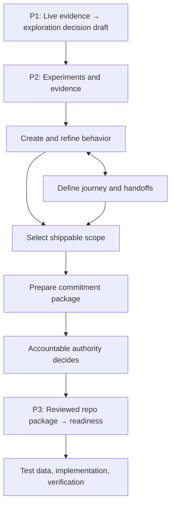

# The AIPOS skill workflow

The pillars describe a product lifecycle. All eleven skills live in the `aipos`
plugin so a handoff does not require another installation. Start at the action the
user requests and the state of the available artifacts.

The diagram is a common route. Validation can start without P1; a no-go can end
the work; new evidence can return it to an earlier step. Corpus views and metrics
can run wherever their inputs exist.

## Ownership and handoffs

| Requested action | Owner | Output and handoff |
|---|---|---|
| Allocate research attention using the live graph | `aipos-quarterly-planning` | Evidence-backed planning pack and draft exploration log; the governed interface records decisions |
| Test an opportunity or summarize experiment evidence | `aipos-rapid-validation` | Experiment artifacts and viability brief; delegates behavior definition and prepares the exact commitment package |
| Create an epic or initiative brief | `aipos-epic-create` | Optional planning artifact; can hand off decomposition to feature-create |
| Author new acceptance criteria or materialize an approved baseline | `aipos-feature-create` | Canonical Rules, scenarios, and feature package; new drafts go to refine, approved baselines retain their behavior unchanged |
| Review existing specifications | `aipos-feature-refine` | 3 Amigos findings, evidence gaps, proposed edits; routes reviewed repo packages to readiness |
| Describe a journey's actors, transitions, and handoffs | `aipos-workflow-map` | `workflow.json` references existing behavior; hands view generation to feature-map |
| Choose the smallest usable release | `aipos-feature-slice` | Proposed behavior selection with prerequisites; returns to commitment preparation for approval |
| Render a corpus or compare advisory assessments | `aipos-feature-map` | HTML view; requests assessment from refine, readiness, or slice as appropriate |
| Check a reviewed repo package before coding | `aipos-feature-readiness` | Readiness report, verification plan, Development Token record, and applicable approval references |
| Generate fixtures, boundary cases, or load data | `aipos-synthetic-data` | Repeatable seeded generator and data; labels scenario-derived or schema-derived coverage |
| Export repository telemetry | `aipos-metrics-emit` | NDJSON events and completeness diagnostics; downstream systems aggregate them |

Detailed instructions and prerequisites remain in the
[skill catalog](../plugins/aipos/README.md).

## Progressive definition during P2

Experiments can remain disposable. As an opportunity develops, feature-create
writes the proposed behavior and refine reviews it. Workflow-map links that
behavior into a journey; slice proposes the selected Rules and scenarios needed
for a useful release. These activities can iterate before a commitment decision.

Validation prepares the evidence, selected behavior, constraints, and immutable
source revision for that decision. The accountable authority approves, rejects,
or requests revision through the project's authoritative interface. A prepared
package, a viability recommendation, or an agent's statement is not approval.

An epic is optional. When the user explicitly wants one, epic-create owns the
brief and feature-create can decompose it. Teams can also work directly from an
evidence-backed opportunity without a tracker, user stories, or estimates.

## Choose by action and review state

- **New criteria → create. Existing criteria with ambiguity → refine.** A request
  mentioning Gherkin does not decide between them; the requested action does.
- **A repo-resident Draft 0 → refine. A reviewed repo package before coding →
  readiness.** Storage location alone does not establish a completed review.
- **Journey source → workflow-map. Rendering existing source → feature-map.**
  A request for both has an explicit author-then-render handoff.
- **Release selection → slice. Release visualization → feature-map.** Complexity
  assessment is optional and does not convert points into dates or capacity.
- **Telemetry → metrics-emit. Execution authorization → readiness.** A complete
  artifact set does not establish product approval, current authority, or passing
  implementation tests.

If “is this ready?” has no context, clarify whether the user means specification
quality, repository readiness, or a product decision. Do not activate every skill.

## What evidence means at P3

Readiness checks reviewed artifacts, repo fit, and a verification path. It does
not require implementation to exist or claim that tests have passed. Where a
project has a decision service, the derived token references the exact product
approval and distinguishes current authority from stale observations. Without
one, the existing local-readiness route remains usable and claims no external
approval.

Refine's 10-dimension assessment and readiness's 12-dimension assessment have
different purposes. The feature map labels the source of each advisory badge;
batch assessment never writes a token. Existing metric event calculations remain
unchanged: completeness can be below 100 while later delivery artifacts are not
yet due, and 100 is not permission to implement.

Changes to committed behavior go through refine's proposed change package and
reapproval path. Human product decisions and application implementation are
outside these eleven skills.
