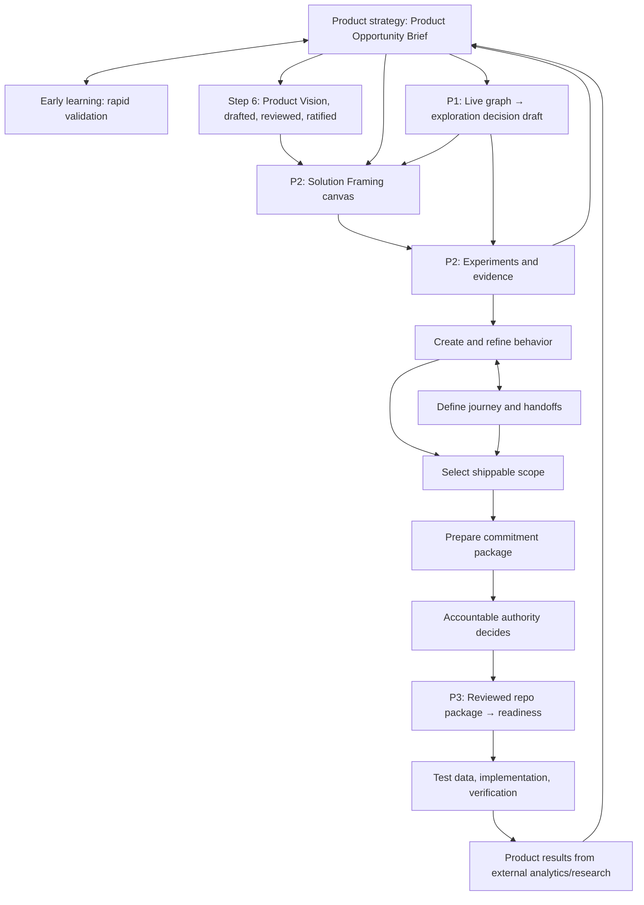

# The AIPOS skill workflow

The pillars describe a product lifecycle. All fourteen skills live in the `aipos`
plugin so a handoff does not require another installation. Start at the action the
user requests and the state of the available artifacts.

```mermaid
flowchart TD
    PS["Product strategy: Product Opportunity Brief"] <--> L["Early learning: rapid validation"]
    PS --> P["P1: Live graph → exploration decision draft"]
    PS --> PV["Step 6: Product Vision, drafted, reviewed, ratified"]
    PV --> SD["P2: Solution Framing canvas"]
    PS --> SD
    P --> SD
    SD --> V["P2: Experiments and evidence"]
    P --> V
    V --> B["Create and refine behavior"]
    B <--> J["Define journey and handoffs"]
    B --> S["Select shippable scope"]
    J --> S
    S --> C["Prepare commitment package"]
    C --> A["Accountable authority decides"]
    A --> R["P3: Reviewed repo package → readiness"]
    R --> D["Test data, implementation, verification"]
    V --> PS
    D --> O["Product results from external analytics/research"]
    O --> PS
```

The diagram is a common route. Validation can start without P1; a no-go can end
the work; new evidence can return it to an earlier step. Corpus views and metrics
can run wherever their inputs exist.

## Starting a new product

Use `aipos-product-strategy` to create a Product Opportunity Brief from the idea
or available evidence: vision, first segment, need, differentiated concept, fit,
viability, outcomes, assumptions, and next decision. A concise draft can contain
unknowns. Commercial and internal products both have a supported route.

The brief is the canonical product-level strategy. Rapid-validation owns the
interview, sizing, demand, prototype, feasibility, and findings artifacts it calls
for; findings return to product-strategy to challenge and revise the same brief.
One initial outcome is enough when a longer roadmap would be speculative.
Exploration planning is useful for allocating capacity across graph-backed
opportunities, and remains optional for an idea with no graph. An explicit request
for an experiment, canvas, or epic does not first require a strategy document.

Agreement on a strategy hypothesis, authorization for learning, evidence for
further investment, and approval of production scope remain distinct. Missing
baselines can motivate learning. The [shared strategy handoff](../plugins/aipos/references/strategy-handoff.md)
carries source revision, evidence, choices, uncertainties, decision sought, and
next owner without duplicating the strategy.

Product results return here for strategy review; collection and analysis remain
with their owning systems. Delivery telemetry alone does not establish customer
or business outcomes.

## Ownership and handoffs

| Requested action | Owner | Output and handoff |
|---|---|---|
| Start, assess, or revise product strategy | `aipos-product-strategy` | One concise Product Opportunity Brief and next learning decision; delegates experiments and receives findings/results for strategy revision |
| Write a Product Vision, or take one through review and ratification | `aipos-product-vision` | One vision record plus a to-do list; the reviewer roster is routed from a risk triage and readiness is computed; ratification records agreement on direction, never approval to build |
| Allocate research attention using the live graph | `aipos-exploration-planning` | Evidence-backed planning pack and draft exploration log; the governed interface records decisions |
| Facilitate a one-page Solution Framing canvas for one problem | `aipos-solution-framing` | `canvas.json` plus a rendered image; facts from the graph, decisions from the PM; hands the panel-6 plan to rapid-validation and the statement and metrics to epic-create when an epic is wanted |
| Test an opportunity or summarize experiment evidence | `aipos-rapid-validation` | Experiment artifacts and viability brief; delegates behavior definition and prepares the exact commitment package |
| Create an epic or initiative brief | `aipos-epic-create` | Optional planning artifact; can hand off decomposition to feature-create |
| Author new acceptance criteria or materialize an approved baseline | `aipos-feature-create` | Canonical Rules, scenarios, and feature package; new drafts go to refine, approved baselines retain their behavior unchanged |
| Review existing specifications | `aipos-feature-refine` | 3 Amigos findings, evidence gaps, proposed edits; routes reviewed repo packages to readiness |
| Describe a journey's actors, transitions, and handoffs | `aipos-workflow-create` | `workflow.json` references existing behavior; hands view generation to map-render |
| Choose the smallest usable release | `aipos-feature-slice` | Proposed behavior selection with prerequisites; returns to commitment preparation for approval |
| Render a corpus, its journeys, or compare advisory assessments | `aipos-map-render` | One offline HTML page: feature map plus an interactive L1/L2/L3 journey diagram showing which scenarios specify a journey and which journeys a feature change affects; requests assessment from refine, readiness, or slice as appropriate |
| Check a reviewed repo package before coding | `aipos-feature-readiness` | Readiness report, verification plan, Development Token record, and applicable approval references |
| Generate fixtures, boundary cases, or load data | `aipos-synthetic-data` | Repeatable seeded generator and data; labels scenario-derived or schema-derived coverage |
| Export repository telemetry | `aipos-metrics-emit` | NDJSON events and completeness diagnostics; downstream systems aggregate them |

Detailed instructions and prerequisites remain in the
[skill catalog](../plugins/aipos/README.md).

## The Product Vision

`aipos-product-vision` owns the Step 6 artifact: who the customer is and what is hard for them,
what solving it is worth to us, the direction and its arc, the boundaries, and the statement that
travels. It runs in three steps — the Product Manager or Owner drafts, Engineering and the routed
stakeholders review, the accountable owner ratifies.

Two things are computed rather than judged. A seven-question risk triage sets the tier, and the
tier picks the reviewer roster from `data/engagement-policy.json`, which Security and Compliance
own: a vision that touches personal data engages Privacy whether or not the author thought to ask.
Readiness is computed the same way, from `data/readiness-rules.json`.

**Learn mode** is the same artifact at exploration depth, granted by the accountable owner after
triage so the grant is made knowing what it routes past. It is for exploring a product or feature,
not for a technical spike, and it is not a reduced vision: the blocks it does not ask are not owed.
Promotion signals tell the owner when an exploration has started behaving like a commitment.

The brief is the product-level strategy; the vision is the artifact Step 7 onward is built and
judged against. Ratifying one records agreement on direction. It is not approval to build, and it
does not clear the Validation Decision, which stays with `aipos-rapid-validation`.

## The Solution Framing canvas

A canvas is often the first P2 artifact for an explored problem: one page — problem,
evidence, hypothesis, options, assumptions and risks, validation and recommendation —
agreed with the team before experiments start. Its facts come only from the Product
Definition Graph; what the graph lacks becomes a GAP with a ReOps to-do, and its
numbers are computed by the verifier rather than typed. Proceed is unavailable until
the primary metric's baseline is graph-backed. The canvas recommends; the accountable
owner decides. Its Proceed / Pivot / Park is about learning — whether to run its validation
plan — not the viability brief's GO / REVISE / NO-GO, which decides production investment
once the evidence is in. Rapid validation then runs the plan the canvas names.

The product brief can accept attributable research outside the graph; the canvas
retains its stricter graph-backed baseline and approval rules. A brief does not
unlock Proceed. Its absence of a baseline can instead lead directly to learning
through rapid-validation. The canvas’s pre-experiment recommendation remains an
input to validation, not evidence that experiments succeeded. The
[bounded follow-up](plans/2026-09-24-aipos-product-strategy.md#remaining-integration-gaps)
records the decision-language and baseline-adapter gaps without changing them here.

## Progressive definition during P2

Experiments can remain disposable. As an opportunity develops, feature-create
writes the proposed behavior and refine reviews it. Workflow-map links that
behavior into a journey; slice proposes the selected Rules and scenarios needed
for a useful release. These activities can iterate before a commitment decision.

Validation prepares the evidence, selected behavior, constraints, and immutable
source revision for that decision. The accountable authority approves, rejects,
or requests revision through the project's authoritative interface. A prepared
package, a viability recommendation, or an agent's statement is not approval.

An epic is optional. When the user explicitly wants one, epic-create owns the
brief and feature-create can decompose it. Teams can also work directly from an
evidence-backed opportunity without a tracker, user stories, or estimates.

## Choose by action and review state

- **Product direction → product-strategy. A named experiment → rapid-validation.**
  An initiative canvas belongs to solution-framing; a requested epic to epic-create.
  Product-level strategy review does not replace graph-backed capacity planning.
- **New criteria → create. Existing criteria with ambiguity → refine.** A request
  mentioning Gherkin does not decide between them; the requested action does.
- **A repo-resident Draft 0 → refine. A reviewed repo package before coding →
  readiness.** Storage location alone does not establish a completed review.
- **Journey source → workflow-create. Rendering existing source → map-render.**
  A request for both has an explicit author-then-render handoff.
- **Release selection → slice. Release visualization → map-render.** Complexity
  assessment is optional and does not convert points into dates or capacity.
- **Telemetry → metrics-emit. Execution authorization → readiness.** A complete
  artifact set does not establish product approval, current authority, or passing
  implementation tests.

If “is this ready?” has no context, clarify whether the user means specification
quality, repository readiness, or a product decision. Do not activate every skill.

## What evidence means at P3

Readiness checks reviewed artifacts, repo fit, and a verification path. It does
not require implementation to exist or claim that tests have passed. Where a
project has a decision service, the derived token references the exact product
approval and distinguishes current authority from stale observations. Without
one, the existing local-readiness route remains usable and claims no external
approval.

Refine's 10-dimension assessment and readiness's 12-dimension assessment have
different purposes. The feature map labels the source of each advisory badge;
batch assessment never writes a token. Existing metric event calculations remain
unchanged: completeness can be below 100 while later delivery artifacts are not
yet due, and 100 is not permission to implement.

Changes to committed behavior go through refine's proposed change package and
reapproval path. Human product decisions and application implementation are
outside these fourteen skills.
